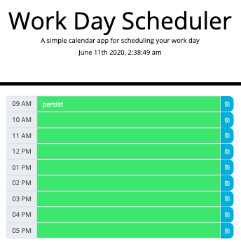

# Week-5-Work-Day-Scheduler

## Thomas Bragg Homework-5 Work Day Scheduler

* ['Github Repository'](https://github.com/TBragg800/Week-5-Work-Day-Scheduler)
* ['Github Deployed Site'](https://tbragg800.github.io/Week-5-Work-Day-Scheduler/)

### Summary:
This project offers a calender applcation that allows the user to save hour by hour events in a 9am to 5pm structured work day using a responsive bootstrap layout and dynamically powered HTML and CSS by JQuery. The design incorporates the Moment.js library leveraging local storage to persist user dictated events in each timeblock. The events are color coded based on the current time to further enhance user experience. 

### Psuedo Code:
* Needs div for each hour.
* Each hour div needs a class to ref all hour divs and an id or class to ref individually.
* Each hour div needs a button with "saveBtn" class and maybe a class to access all buttons "btn".
* Use moment.js to incorporate and format date and time
* Current day and time must be appear in the jumbotron
* Hour must start at 9.
* Statements to handle if hour is past, present or future.
  * Might be able to write code to handle each hour in one code???
  
* Choose which method to use to get items from local storage. getItem() appears the easiest.
* Event listner for save button.
      

### Features:
* A header section containing the current date and time.
* Established timeblocks representing a 9am to 5pm work schedule.
* Each timeblock change has a real time representation of past, present or future hour indicated by color.
* For each timeblock, text will persist for user dictated events.

### Code Validator
* Code validation by W3C for HTML and CSS
* Code validation by BeautifyTools for Javascript

#### Screenshot of deployed application
